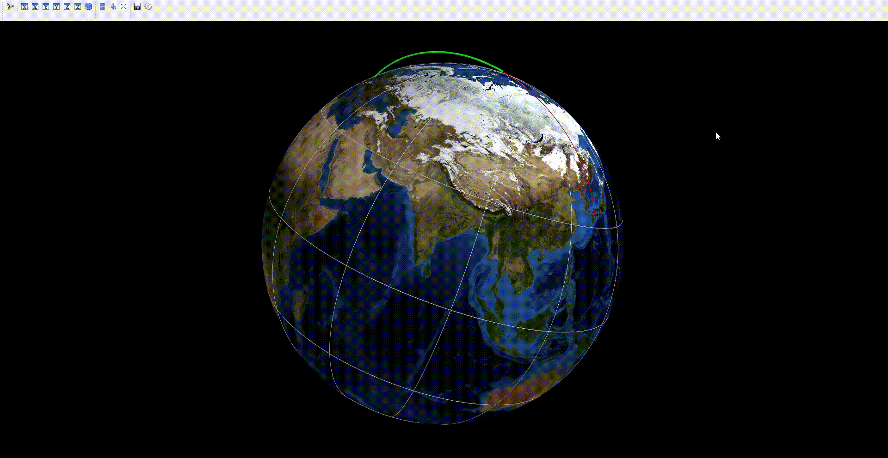

# CW balistique W2

## Nom
Simulation numérique d'un tir de missile.

## Objectifs
Le but de ce projet est de développer une simulation de tir de missile en implémentant au fur et à mesure différentes forces, un affichage dynamique et interactif en trois dimensions ainsi qu'un processus d'optimisation qui permet, à partir d'un point cible, d'obtenir les meilleurs conditions initiales de tir.

## Visuels

## Installation 

pip install -r requirements.txt

## Lancement

Lancez le porgramme Mayavi.py

## Auteurs
* Ange LAVIALLE 
* Julien LABORDE
* Hugo VUACHEUX
* Virgile PRAT BALAGNA
* Paul DO CARMO SILVA
* Robin CAPELLE
